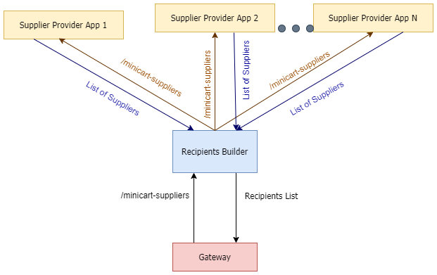

# Supplier Protocol 

### Glossary 

| Word               | Meaning                                                                                                                                               |
| ------------------ | ----------------------------------------------------------------------------------------------------------------------------------------------------- |
| Supplier           | Anyone who provides a service to the merchant and participate in the split                                                                            |
| Split              | The operation that splits the amount of the payment among the suppliers                                                                               |
| Supplier Provider  | An API that provides the supplier that will be called by the `recipients builder`                                                                     |
| [Recipients builder](https://github.com/vtex/recipients-builder) | The IO App that will identify the supplier provider linked in the account and will request all the providers, then send the result to the ``gateway`` |
| Gateway            | The application that process the payment                                                                                                                                                      |
| Suppliers Providers Builder | A builder present in the builder-hub, declared in the manifest.json. <br> automaticallyThis builder automatically sets the route that will be called by the recipients-builder and the necessaries policies of the supplier provider | 

# Supplier Protocol 

## How It Works

An brief overview of the Supplier Protocol is this image 


In the moment where the split will occurr the `RecipientsBuilder` app will be called. This app will make a request to all apps that use the `SupplierProviderBuilder`, after that it will respond the merged recipients to the `Payment Gateway`. 
The route that will be called by the `RecipientsBuilder` app is ``/minicart-supplier`

### Pre-requirements
There are some mandatory requirements to use the Supplier Protocol
- The recipient builder app **must** be installed in the account
  - You can check if is installed by `vtex ls` command 
  - If it's not you can install using `vtex install recipients-builder`
- You need to configure the account to use split. So you must use an connecor that allows split and a configured afiliation. 


### The payload format
Currently the data that the supplier provider will receive is composed by the transaction id, order id and MiniCart as payload
```ts 
{
  miniCart: MiniCart
  transactionId?: string
  orderId?: string
  currency?: string = 'BRL'
  operationValue?: number
  chargeProcessingFee?: boolean = null
  chargebackLiable?: boolean = null
  proportionalRefund?: boolean = false
}
```
Where MiniCart is 
```ts
{
  items?: Items[]
  sellers?: Array<{
    id: string
    name: string
    document: string
    documentType: string
  }>
  freight?: number
  orderUrl?: string
  tax?: number
  shippingdate?: Date
  shippingestimated?: string
  isGiftRegistry?: bool
  giftRegistryDescription?: string
  giftRegistryId?: strinsg
  isPickupStore?: boolean
  isCallCenter?: bool
}
```
Where Item is 
```ts 
 {
  id: string
  name: string
  value: number
  quantity: number
  priceTags?: [
    {
      name: string
      value: number
      isPercentual: bool
    }
  ]
  components?: Item[]
  comissions?: number
  freightCommission?: number
  sellerChain?: string[]
  shippingDiscout?: number
  discount?: number
  refId?: string
  productId?: string
  sellingPrice?: number
  sellerId?: string | null
  dockId?: string
  categoryId?: string
  categoryName?: string
  deliveryChannel?: string
  deliveryType?: string
  deliverySlaInMinutes?: Long
  deliveryWindow?: {
    startDate: Date
    endDate: Date
  }
  tax?: number
  freight?: number
}
```


### The response format 
The expected response type is a list of suppliers
  ```Typescript
    [{
      id: string
      name: string
      documentType: string
      document: string
      role: string
      amount: number
    }]
  ```


# Implementing a supplier provider

1. Clone this repo
2. Verify the configs and requirements
3. Start hacking!

In this example, you can just write you implementation in this controller:

```ts
export async function provideSuppliersUsingMiniCart({
  req,
  response,
}: Context) {
  const payload = await json(req)
  const suppliers = getSuppliersByMiniCart(payload)

  response.status = 200
  response.body = suppliers
}
```


#### Verify Builder

The `Supplier Provider Builder` will automatically set the route `/minicart-suppliers` , this route is the one that will be called by the `Recipients Builder` . By default this build is already declared in this example. 
``` json
{
	...

	"builders": 
	{
		"supplierProvider": "0.x",
		"node": "6.x"
	}
	...
}
```
If the `supplierProvider` build it's not declared the app will not be used

## Testing

You can test your Supplier Provider by link it (`vtex link`) and mock the Gateway request, by making a resquest to this route:
```
POST https://app.io.vtex.com/vtex.recipients-builder/v1/{account}/{workspace}/minicart-suppliers
```
The payload that you need to send implements the same interface that you will be recieving. 

Here's an example of payload

``` json

{
    "transactionId": "8C8D8541553211EEE2D08E3B3B3F9",
    "orderId": "1234567",
    "currency": "BRL",
    "operationValue": 38639,
    "chargeProcessingFee": "false",
    "chargebackLiable": "false",
    "proportionalRefund": "false",
    "miniCart": {
        "items": [
            {
                "id": "76671",
                "name": "Mocked Item",
                "value": 0,
                "quantity": 1,
                "priceTags": [],
                "components": null,
                "commission": 0,
                "freightCommission": 0,
                "sellerChain": null,
                "shippingDiscount": 0,
                "discount": 0,
                "refId": null,
                "productId": null,
                "sellingPrice": 0,
                "sellerId": null,
                "dockId": null,
                "categoryId": null,
                "categoryName": null,
                "catergoryName": null,
                "deliveryChannel": null,
                "deliveryType": null,
                "deliverySlaInMinutes": null,
                "deliveryWindow": null,
                "tax": 0,
                "freight": 0
            }
        ],
        "freight": 1739,
        "orderUrl": "http://www.someaccount.com/admin/checkout/#/orders?q=10000",
        "tax": 0,
        "shippingdate": null,
        "shippingestimated": "2bd",
        "isGiftRegistry": null,
        "giftRegistryDescription": null,
        "giftRegistryId": null,
        "isPickupStore": null,
        "isCallCenter": null
    }
}
```
If everything works well the response it will be a list like this:
```json
[
    {
        "id": "mock",
        "name": "mocked",
        "amount": 38639,
        "document": "1111",
        "documentType": "CNPJ",
        "role": "influencer",
        "commissionAmount": 100,
        "chargebackLiable": false,
        "chargeProcesssingFee": false
    },
    {
        "id": "coinshop",
        "name": "coinshop",
        "documentType": "CNPJ",
        "document": "05314972000174",
        "role": "seller",
        "amount": 0,
        "commissionAmount": 0,
        "chargeProcessingFee": "false",
        "chargebackLiable": "false"
    }
]
```
#### Attention: The some of recipients amount must be less or equal to the transaction value

After this you can try to finish a transaction using a account that allows supplier protocol. If everything is ok, the recipients of the transaction it will be the provided by the supplier provider apps installed in the account